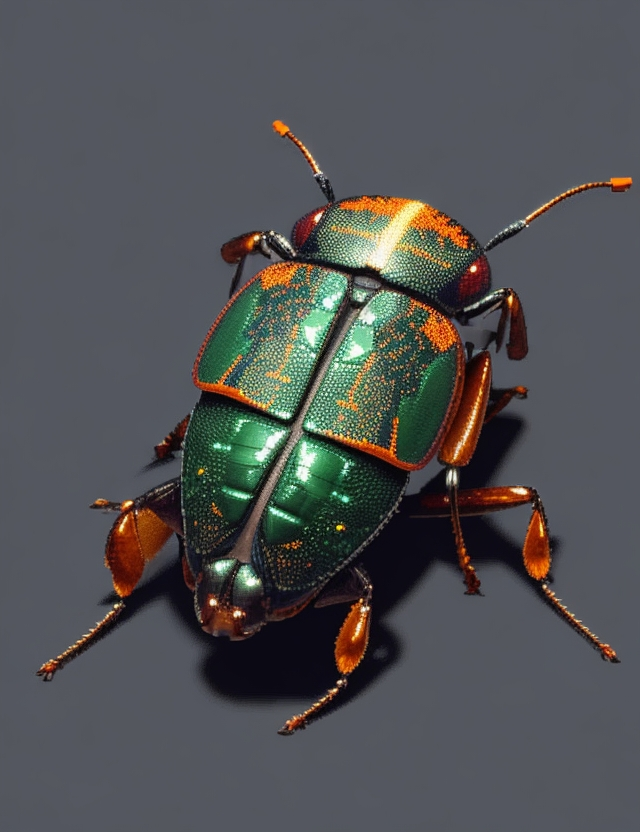

# image-to-hexadecimal-converter


## Description

The image to hexadecimal converter is a Python script that converts images into hexadecimal digits characters using a dot matrix approach. The resulting ASCII art is saved to a text file, providing a unique representation of the input image.

## Table of Contents

- [Installation](#installation)
- [Usage](#usage)
- [Examples](#examples)
- [Contributing](#contributing)

## Installation

1. Ensure you have Python installed on your machine.
2. Install the required dependencies using the following command:
    ```bash
    pip install pillow
    ```
   
## Usage

To use the image to hexadecimal converter, follow these steps:

1. Clone the repository:
    ```bash
    git clone https://github.com/your-username/dot-art-generator.git
    cd dot-art-generator
    ```

2. Run the script:
    ```bash
    python dot_art_generator.py
    ```
   Follow the prompts to provide the image path and choose an output file name.

3. Check the output:
   The resulting ASCII art will be saved as a text file with the specified name.

## Example




## Contributing

Contributions are welcome! If you find a bug or have an enhancement in mind, please open an issue or create a pull request. Follow these steps to contribute:

1. Fork the repository
2. Create a new branch: `git checkout -b feature-name`
3. Make your changes and commit them: `git commit -am 'Add feature'`
4. Push to the branch: `git push origin feature-name`
5. Open a pull request
